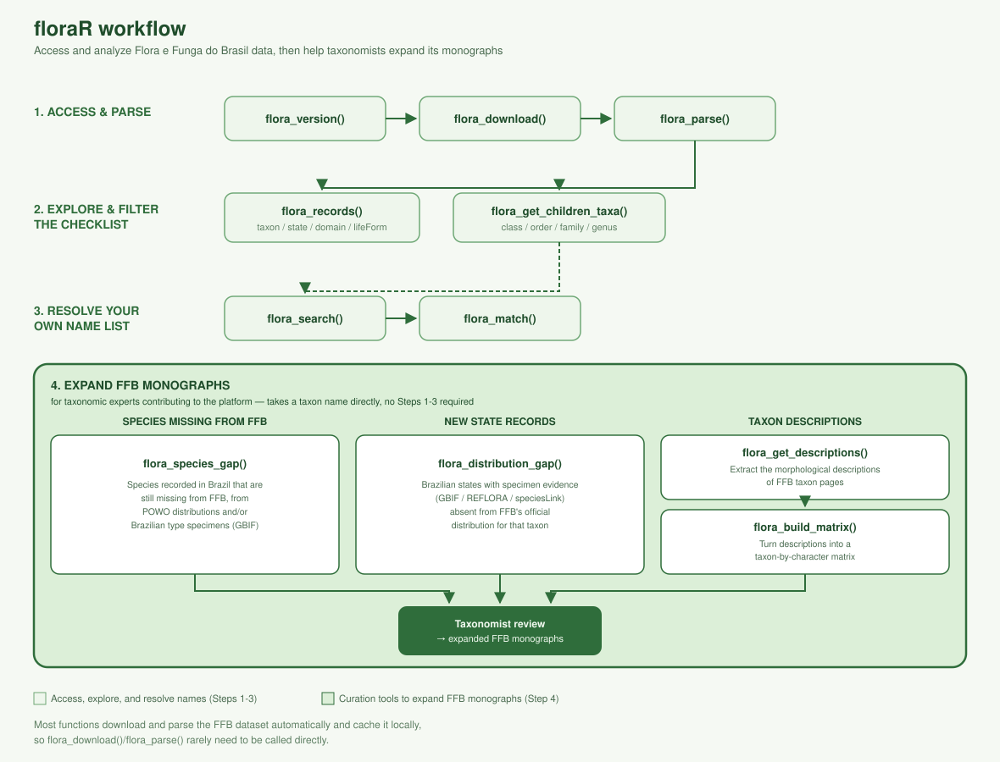

<!-- README.md is generated from README.Rmd. Please edit that file -->

```{r, include = FALSE}
knitr::opts_chunk$set(
  collapse = TRUE,
  comment = "#>",
  fig.path = "figures/",
  out.width = "100%"
)
```

# floraR 

<!-- badges: start -->
[](https://app.codecov.io/gh/DBOSlab/floraR)
[](https://github.com/DBOSlab/floraR/actions/workflows/test-coverage.yaml)
[](https://github.com/DBOSlab/floraR/actions/workflows/R-CMD-check.yaml)
[](LICENSE)
<!-- badges: end -->

`floraR` is an R package for accessing, analyzing, and curating taxonomic and distributional data on plants and algae from the [Flora e Funga do Brasil (FFB)](https://floradobrasil.jbrj.gov.br/consulta/) platform, maintained by the Rio de Janeiro Botanical Garden. It provides a comprehensive interface to download, parse, filter, and explore Darwin Core Archive (DwC-A) datasets from the [FFB IPT](https://ipt.jbrj.gov.br/jbrj/resource?r=lista_especies_flora_brasil) data portal — from browsing the checklist by taxonomic/geographic/trait criteria to resolving and matching your own species name lists against it.

But `floraR` is designed to do more than retrieve data from FFB: it is meant to help taxonomists expand the current FFB monographs. By cross-checking FFB against global resources - the species distributions of [Plants of the World Online](https://powo.science.kew.org) and the type specimens collected in Brazil that herbaria publish through [GBIF](https://www.gbif.org) - it points to species that are recorded in Brazil but not yet treated in FFB, giving specialists a concrete starting point for bringing each monograph closer to a complete account of the Brazilian flora.

The package is designed to streamline both data exploration for researchers and data curation workflows for taxonomic experts contributing to the Flora e Funga do Brasil.

## Workflow



## Installation

You can install the development version of `floraR` from [GitHub](https://github.com/DBOSlab/floraR) with:

``` r
if (!requireNamespace("BiocManager", quietly = TRUE)) 
install.packages("BiocManager") 

# Install the development version of floraR from GitHub, 
# together with its required dependencies 
BiocManager::install("DBOSlab/floraR", dependencies = TRUE)
```

To use Plants of the World Online evidence in `flora_species_gap()`, also install the [rWCVPdata](https://github.com/matildabrown/rWCVPdata) package, which provides a local copy of the World Checklist of Vascular Plants (it is not on CRAN):

``` r
install.packages("rWCVPdata",
                 repos = c("https://matildabrown.github.io/drat",
                           "https://cloud.r-project.org"))
```

```r
library(floraR)
```


## Usage

`floraR` supports a full workflow for working with Flora e Funga do Brasil data:

- Check available versions with `flora_version()`
- Download datasets with `flora_download()`
- Parse datasets with `flora_parse()`
- Filter and retrieve checklist records with `flora_records()`
- Resolve your own species names against the checklist with `flora_search()` and `flora_match()`
- Explore the taxonomic hierarchy with `flora_get_children_taxa()`
- Find species missing from FFB with `flora_species_gap()`
- Find candidate new state records with `flora_distribution_gap()`
- Curate new records with `flora_get_descriptions()` and `flora_build_matrix()`

Most functions download and parse the FFB dataset automatically and cache it locally, so you rarely need to call `flora_download()`/`flora_parse()` yourself unless you want to inspect the raw data directly.


#### _1. `flora_version`: Check available dataset versions_

Get metadata about available Flora e Funga do Brasil dataset versions, including version numbers, release dates, and whether they are the latest version.

```r
library(floraR)

# Get all available versions
versions_df <- flora_version()
head(versions_df)

# View specific version details
versions_df[versions_df$Latest == TRUE, ]
```


#### _2. `flora_download`: Download Flora e Funga do Brasil datasets_

Download taxonomic and distributional records in Darwin Core Archive (DwC-A) format. The function supports downloading the latest version, specific versions, or all available versions.

```r
library(floraR)

# Download the latest dataset version (default)
flora_download(dir = "flora_download")

# Download a specific version
flora_download(version = "393.418", dir = "flora_download")

# Download multiple versions
flora_download(version = c("393.418", "392.417"), dir = "flora_download")

# Download all available versions (large download!)
flora_download(version = "all", dir = "flora_download")
```


#### _3. `flora_parse`: Parse downloaded DwC-A datasets_

Parse and organize locally downloaded Flora e Funga do Brasil datasets for analysis. This function works offline once datasets are downloaded, and returns a named list with a `taxon.txt`, `distribution.txt`, and `speciesprofile.txt` table (among others) per downloaded version.

```r
library(floraR)

# Parse the latest downloaded version
dwca_data <- flora_parse(path = "flora_download",
                         version = "latest")

# View structure of the parsed data
names(dwca_data)
names(dwca_data[["dwca_ffb_v393_418"]][["data"]])

# Access specific data tables directly
taxon_data <- dwca_data[["dwca_ffb_v393_418"]][["data"]][["taxon.txt"]]
distribution_data <- dwca_data[["dwca_ffb_v393_418"]][["data"]][["distribution.txt"]]
```


#### _4. `flora_records`: Filter and retrieve checklist records_

Browse and filter the FFB checklist directly by taxonomic, geographic, and trait-based criteria — no input name list required. Downloads and parses the dataset automatically (like `flora_search()`, reusing the local cache on repeated calls).

```r
library(floraR)

# All accepted species in Fabaceae
fabaceae <- flora_records(taxon = "Fabaceae",
                          taxonomicStatus = "NOME_ACEITO")

# Accepted species endemic to Bahia
bahia_endemics <- flora_records(state = "Bahia",
                                endemism = TRUE,
                                taxonomicStatus = "NOME_ACEITO")

# Species in the Caatinga with a shrub life form
caatinga_shrubs <- flora_records(phytogeographicDomain = "Caatinga",
                                 lifeForm = "Arbusto")

# Save the result to a CSV file
flora_records(taxon = "Luetzelburgia", save = TRUE, dir = "flora_records")
```


#### _5. `flora_search` and `flora_match`: Resolve your own species names_

Unlike `flora_records()`, which browses the checklist itself, `flora_search()` and `flora_match()` take a list of names *you already have* (e.g. from your own herbarium or field data) and resolve them against the FFB checklist — with exact matching first, then fuzzy (Levenshtein-distance) matching as a fallback for typos.

```r
library(floraR)

# Resolve a single name (synonyms are resolved to their accepted name)
flora_search("Mimosa pyrenea")

# Resolve a list, flagging exact vs. fuzzy matches
splist <- c("Mimosa sensitiva", "Swartzia simplex", "Inga edullis")
flora_search(splist, show_correct = TRUE, progress_bar = TRUE)

# Compare two independent name lists, aligning names that resolve to the
# same accepted taxon (e.g. checking your list against a collaborator's)
splist1 <- c("Mimosa sensitiva", "Swartzia simplex", "Inga edulis")
splist2 <- c("Swartzia simplex var. grandiflora", "Inga edulis", "Mimosa pyrenea")
flora_match(splist1, splist2, include_all = TRUE)
```


#### _6. `flora_get_children_taxa`: Explore the taxonomic hierarchy_

Retrieve all child taxa (species, subspecies, varieties, genera, etc.) below a given taxonomic name and rank — useful for getting every species in a genus, every genus in a family, and so on.

```r
library(floraR)

# All species in a genus
flora_get_children_taxa(taxon_name = "Luetzelburgia",
                        rank = "genus",
                        child_rank = "species")

# All genera in a family, including synonyms
flora_get_children_taxa(taxon_name = "Fabaceae",
                        rank = "family",
                        child_rank = "genus",
                        include_synonyms = TRUE)
```


#### _7. `flora_species_gap`: Find species missing from FFB_

For a genus of plants or algae, list the species-level names that occur in Brazil but that FFB does not register yet, from two independent kinds of evidence: the species distributions of [Plants of the World Online (POWO)](https://powo.science.kew.org), and type specimens collected in Brazil that herbaria publish through [GBIF](https://www.gbif.org). The result is one table, one row per name, with a `Found_in` column: names reported by both sources are listed first, as the strongest candidates. Names that FFB holds under a different genus or spelling are recognised, so they are not reported as missing. POWO's data is read locally from `rWCVPdata` by default (fast), or live from ChecklistBank with `powo_source = "checklistbank"`; each GBIF name comes with a summary of its Brazilian type specimens. The result is also saved as an `.xlsx` spreadsheet and an HTML report.

```r
library(floraR)

# Species of Myrcia recorded in Brazil by POWO and/or with Brazilian type
# specimens in GBIF, but missing from FFB
gap <- flora_species_gap(taxon = "Myrcia")

# POWO only, read live from ChecklistBank instead of the local WCVP copy
gap_powo <- flora_species_gap(taxon = "Myrcia", sources = "powo",
                              powo_source = "checklistbank")

# An algal genus: GBIF type specimens only (POWO covers vascular plants)
gap_algae <- flora_species_gap(taxon = "Gracilaria", sources = "gbif")
```


#### _8. `flora_distribution_gap`: Find candidate new state records_

For a genus or species of plants or algae, compare the Brazilian states where specimens have been recorded against the states officially listed in its FFB distribution, and flag the states not yet in FFB as candidate new state records. Occurrences come from [GBIF](https://www.gbif.org) by default - in a single request, with GBIF's free-text state names normalised - and optionally from REFLORA herbarium specimens (via [refloraR](https://github.com/DBOSlab/refloraR)) and [speciesLink](https://specieslink.net) (with a free API key). For a genus, FFB's distribution combines all its species; for a synonym, its accepted name's distribution is used. The HTML report lists the individual records behind each candidate state, so each one can be checked.

```r
library(floraR)

# Candidate new state records for a species
gap <- flora_distribution_gap(taxon = "Luetzelburgia auriculata")

# A whole genus, restricted to two states
gap_ne <- flora_distribution_gap(taxon = "Luetzelburgia",
                                 state = c("Pernambuco", "Paraiba"))

# Adding REFLORA herbarium specimens (requires refloraR)
gap_reflora <- flora_distribution_gap(taxon = "Luetzelburgia auriculata",
                                      sources = c("gbif", "reflora"))
```


## Data Curation Workflow
`floraR` also supports taxonomic experts in curating and updating Flora e Funga do Brasil records. The package facilitates integration of new species names and records from global biodiversity repositories such as IPNI, Plants of the World Online (POWO), REFLORA, and GBIF.

`flora_get_descriptions()` scrapes the controlled-field and free-text descriptions from FFB taxon pages, and `flora_build_matrix()` turns the extracted descriptions into a character matrix (taxa x character states) ready for downstream comparison or trait analysis:

```r
library(floraR)

taxa <- flora_get_children_taxa(taxon_name = "Luetzelburgia",
                                rank = "genus",
                                child_rank = "species")

descriptions <- flora_get_descriptions(taxa, delay = 10)
trait_matrix <- flora_build_matrix(descriptions[[1]])
```


## Key Features
- Comprehensive Data Access: Direct interface to the Flora e Funga do Brasil IPT data portal
- Version Control: Track and download specific dataset versions
- Offline Capability: Parse and analyze downloaded data without internet connection
- Checklist Filtering: Browse and filter the FFB checklist by taxonomic, geographic, and trait-based criteria without an input name list
- Name Resolution: Exact and fuzzy matching of your own species lists against the FFB checklist, including synonym resolution
- Taxonomic Hierarchy: Retrieve child taxa at any rank, from class down to species
- Gap Analysis: Find species that Plants of the World Online records in Brazil, or whose type specimens were collected in Brazil (GBIF), but that are still missing from FFB, and candidate new state records from specimen evidence
- Data Cleaning: Automated parsing and standardization of DwC-A fields
- Taxonomic Workflows: Tools for data curation and integration with global repositories
- Tidyverse Integration: Seamless integration with dplyr, tidyr, and other tidyverse packages


## Documentation
Full function documentation and articles are available at the `floraR` [website](https://dboslab.github.io/floraR-website/).


## Citation
Cardoso, D. 2026. floraR: An R Package for Accessing, Analyzing, and Curating Plant and Algae Data from the Flora e Funga do Brasil Platform. https://github.com/dboslab/floraR


## Contributing
Contributions are welcome! Please feel free to submit a Pull Request or open an issue on [GitHub](https://github.com/DBOSlab/floraR/issues).


## License
`floraR` is released under the MIT license. See the LICENSE file for more details.
